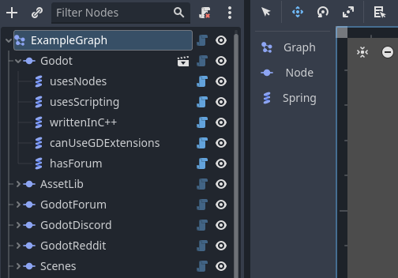

# force-directed-graph-godot
is a simple implementation of a [Force-Directed Graph](https://en.wikipedia.org/wiki/Force-directed_graph_drawing) (or FDG for short) in the Godot Engine.

#### Features
- 2D implementation of a Force-Directed Graph
- Flexible and easy to use Graph Nodes that can be extended and customized
- Editor UI for adding new nodes to your graph
- Real-time graph simulation in the editor (optional)

#### Supported Versions
Every 4.X version of the Godot Engine should work. The plugin was tested with Godot 4.1!

## What is a Force-Directed Graph?
> Force-directed graph drawing algorithms are a class of algorithms for drawing graphs in an aesthetically-pleasing way. (Wikipedia)

The graph is a physical simulation of a system of bodies (nodes) connected by springs (edges). The system is simulated by applying forces to the nodes and then updating their positions.

    
    
    
    
    
    
    
    
    
    
    
    
    
    
    
    

`force-directed-graph-godot` uses an implementation of the method showcased in [this incredible lecture by David Dobervich](https://www.youtube.com/watch?v=PTBuq0CXpWs). You can read a more in-depth explanation of the algorithm in the [
Handbook of Graph Drawing and Visualization](https://cs.brown.edu/people/rtamassi/gdhandbook/chapters/force-directed.pdf)!

## Usage
### Setup
1. Add a `ForceDirectedGraph` node to your scene.
2. Add `FDGNode` nodes as children of the `ForceDirectedGraph` node. (Make sure to add a sprite or set `draw_point` to `true`)
3. Add `FDGSpring` nodes as children of the `FDGNode` nodes.
4. Connect the `FDGNode` nodes with `FDGSpring` nodes by setting the `node_start` and `node_end` properties of the `FDGSpring` nodes.
5. After adding new Nodes or Springs, click the `Update Graph` button on the `ForceDirectedGraph` node to update the graph.

> Warning: You might have to **reload** your scene after adding new nodes to the graph, if `Update Graph` does not work.

### Nodes

**ForceDirectedGraph** 
The main node of the graph. It is responsible for updating the positions of the nodes and springs. When adding new nodes or springs via code, you can call the `update_graph()` function to update the graph.

**FDGNode** 
A node that is part of the graph. Can have different physical properties, such as speed, drag, radius, mass, etc.

**FDGSpring** extends `Line2D` 
The connection between two `FDGNode` nodes. The `node_start` and `node_end` properties must be set to the `FDGNode` nodes that should be connected by this spring.

## Example
 
You can find this example graph in the `example` folder of the project. It uses a basic setup of `FDGNode`s and `FDGSpring`s including one custom node (the big Godot Logo).

 
A simple UI for adding new nodes to the graph is also avaiable. Hover over the buttons to see their shortcuts.

## Common questions and problems
**Q:** Why are there still lines, even if I removed all `FDGSpring` nodes? 
**A:** You might need to reload the scene or use the `update_graph` on the `ForceDirectedGraph` node. 

**Q:** Why are the nodes invisble? 
**A:** `FDGNode`s are empty nodes by default. You can either enable `draw_point` to draw a point with the current radius or add your own sprites/scenes as children.

**Q:** Why are the nodes not moving in the editor? 
**A:** You can disable editor simulation on the `ForceDirectedGraph` node.

**Q:** Why are the connection lines looking so jagged? 
**A:** Try activating 2D anti-aliasing on the `FDGSpring` nodes AND in the project settings.

## Documentation
For additional information, please refer to the documentation generated by the Godot Engine (F1) or dive into the source code yourself.

## Future features
- Automatically update the graph when adding/connecting new nodes or springs.
- An easier way to add and connect nodes. (Editor GUI or toolbar)

- Further optimizations and improvements.

## Contributing
If you have any ideas or suggestions, feel free to open an issue or pull request. You can also add me on Discord (`thepat02`) to discuss ideas or ask questions.
